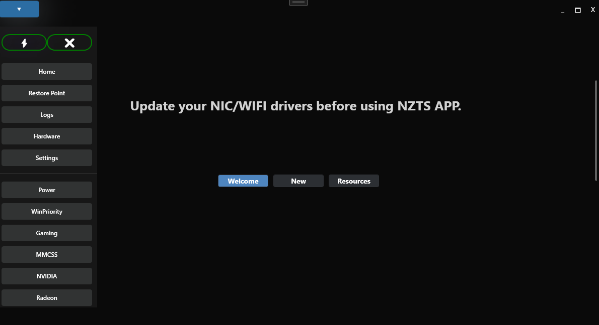

# NZTS APP

NZTS APP is a powerful FPS (Frames Per Second) boosting program designed to enhance your gaming experience. By optimizing system settings and resources, NZTS APP helps you achieve higher frame rates and smoother gameplay.

## Features

- **Optimize All**: A one-click solution to apply all optimizations for maximum FPS improvement.
- **Restore All**: Easily remove all applied settings to revert back to default configurations.
- **NVIDIA Tweaks**: Optimize settings specifically for NVIDIA graphics cards.
- **AMD Tweaks**: Enhance performance for AMD graphics cards.
- **CPU Priority**: Adjust CPU priority settings to favor your gaming applications.
- **MSI Mode**: Enable MSI (Message Signaled Interrupts) for better performance.
- **Power Plan Optimization**: Set your system to the best power plan for gaming.
- **Remove Telemetry**: Disable unnecessary telemetry for improved privacy and performance.

## Installation

1. Download the latest version of NZTS APP from the [releases page](https://github.com/nezhatweaks/nztsapp/releases).
2. Extract the downloaded files to your preferred directory.
3. Run `NZTS_APP.exe` to start the application.

## Requirements

- Windows 10 or later
- .NET 8 installed
- Minimum 4 GB RAM (recommended for optimal performance)

## Usage

1.Launch the NZTS APP.
2.Click the blue menu button in the top-left corner to open the sidebar.
3.Press the Quick Boost button to instantly apply all optimizations within seconds.
4.Explore more settings, from verified to experimental, within the NZTS APP.
5.Enjoy your enhanced gaming experience!

## Credits

This project uses the **Windows Defender Remover** script by [Ionut Bara](https://github.com/ionuttbara/windows-defender-remover). This work is licensed under the [Creative Commons Attribution-NonCommercial 4.0 International License](http://creativecommons.org/licenses/by-nc/4.0/).

Thank you for creating and maintaining this tool!

## License

This project is licensed under the GNU General Public License v3.0 (GPLv3).  
See the [LICENSE](./LICENSE) file for details.

