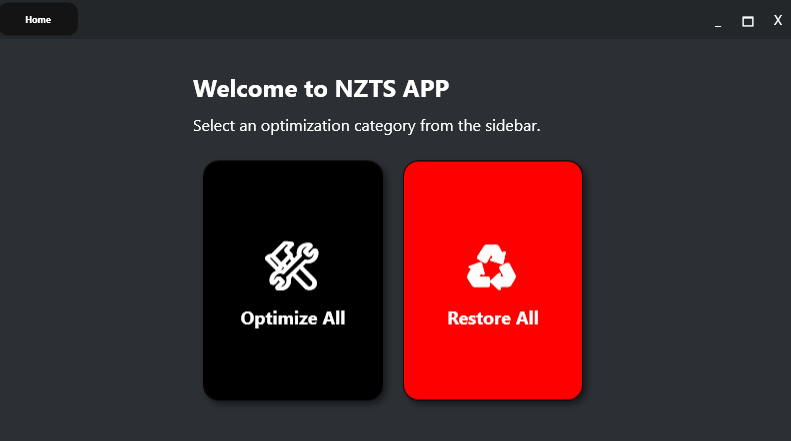

# NZTS APP

NZTS APP is a powerful FPS (Frames Per Second) boosting program designed to enhance your gaming experience. By optimizing system settings and resources, NZTS APP helps you achieve higher frame rates and smoother gameplay.

## Features

- **Optimize All**: A one-click solution to apply all optimizations for maximum FPS improvement.
- **Restore All**: Easily remove all applied settings to revert back to default configurations.
- **NVIDIA Tweaks**: Optimize settings specifically for NVIDIA graphics cards.
- **AMD Tweaks**: Enhance performance for AMD graphics cards.
- **CPU Priority**: Adjust CPU priority settings to favor your gaming applications.
- **MSI Mode**: Enable MSI (Message Signaled Interrupts) for better performance.
- **Power Plan Optimization**: Set your system to the best power plan for gaming.
- **Remove Telemetry**: Disable unnecessary telemetry for improved privacy and performance.

## Installation

1. Download the latest version of NZTS APP from the [releases page](#).
2. Extract the downloaded files to your preferred directory.
3. Run `NZTS_APP.exe` to start the application.

## Requirements

- Windows 10 or later
- .NET 8 installed
- Minimum 4 GB RAM (recommended for optimal performance)

## Usage

1. Launch NZTS APP.
2. Click the **"Optimize All"** button to apply all optimizations.
3. If you wish to remove all applied settings, click the **"Restore All"** button.
4. Enjoy your enhanced gaming experience!

## License

This project is licensed under the MIT License. See the [LICENSE](LICENSE) file for details.

